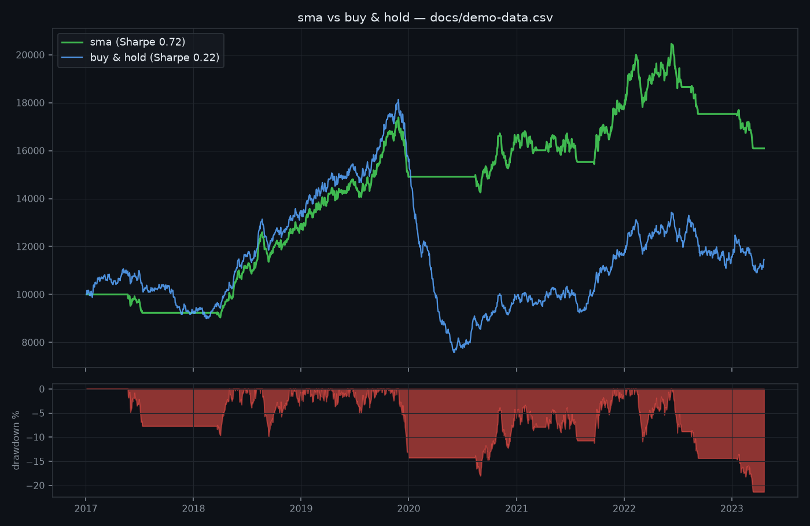

# 📈 quantsim

**Backtest trading strategies on real market data. Simulate the future with Monte Carlo. All in your terminal.**

quantsim is a small, honest quant research toolkit: a daily backtesting engine with a plug-in strategy API, real market data (yfinance or a zero-dependency Stooq fallback), institutional risk metrics — **Sharpe, VaR/CVaR, max drawdown, CAGR, exposure** — and equity-curve charts. Built on NumPy, fully tested, MIT licensed.



*Demo run on a synthetic bull → crash → recovery series (included in `docs/`, generated by quantsim's own GBM engine, so the repo works offline). The trend filter's whole job is visible in one picture: it goes flat through the crash — max drawdown −21% vs −58% — and re-enters for the recovery. Run the same command with `--symbol SPY` for the real thing.*

## 🚀 Quickstart

```bash
pip install "quantsim[all] @ git+https://github.com/hilothefunnydog123-coder/quantsim.git"

# backtest a 20/100 SMA crossover on 10 years of real SPY data
quantsim backtest --symbol SPY --strategy sma --fast 20 --slow 100 --plot spy.png

# Monte Carlo: 10,000 possible futures for a $10k portfolio
quantsim mc --initial 10000 --mu 0.07 --sigma 0.18 --years 10
```

```
quantsim backtest — sma on SPY · 2,517 bars · 2015-06-29 → 2025-06-27 · costs 1 bps

metric                     sma    buy & hold
total return           +xx.xx%      +xxx.xx%
CAGR                    +x.xx%        +x.xx%
volatility             +xx.xx%       +xx.xx%
Sharpe (rf=0)             x.xx          x.xx
max drawdown           -xx.xx%       -xx.xx%
exposure                   xx%          100%
trades                      xx             1
```

No API keys needed: data comes from **yfinance** if installed, otherwise from **Stooq's free CSV endpoint** with nothing but the standard library. You can also backtest any local CSV with `Date,Close` columns via `--csv`.

## 🧩 Write your own strategy in 8 lines

The entire strategy API is one method: given all closes up to today, return a target weight in [-1, 1].

```python
import numpy as np
from quantsim import Strategy, fetch, run_backtest

class Breakout(Strategy):
    name = "breakout"
    warmup = 55

    def target_weight(self, closes: np.ndarray) -> float:
        return 1.0 if closes[-1] >= closes[-55:].max() else 0.0

series = fetch("QQQ", start="2015-01-01")
result = run_backtest(series.closes, Breakout(), dates=series.dates, cost_bps=1)
print(result.metrics["sharpe"], result.metrics["max_drawdown"])
```

Built-ins: `buyhold`, `sma` (moving-average crossover), `momentum` (time-series momentum), `meanrev` (z-score dip buyer). All deliberately readable — fork them.

## 🛡️ The engine is honest

Backtests lie in well-known ways; this engine is built to refuse the big ones:

- **No lookahead — enforced by test.** The weight chosen with data through day *t* earns the return from *t* to *t+1*, never day *t*'s own return. A test literally records what each strategy call is allowed to see (`tests/test_backtest.py::test_no_lookahead_is_enforced`).
- **Transaction costs are on by default** (1 bp per unit of turnover) — churny strategies pay for it.
- **Buy & hold is always the benchmark**, printed side by side. If your strategy can't beat it after costs, quantsim will be the first to tell you.

## 🎲 Monte Carlo mode

The original quantsim core: exact log-space GBM paths (no discretization bias), vectorized VaR/CVaR/drawdown analytics, and ASCII histograms — see `quantsim mc --help`. Useful for answering "what's the 5th-percentile outcome of this savings plan?" in one command.

## ✅ Tests

```bash
pip install -e ".[dev]"
pytest
```

19 tests cover statistical correctness (simulated means converge to analytical GBM expectations), engine honesty (lookahead, cost accounting, flat-strategy invariance), and strategy behaviour in engineered trends, crashes and dips.

## 📄 License

MIT — do whatever you want, PRs welcome.
